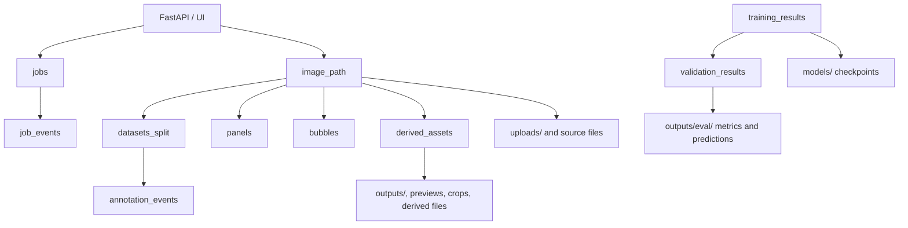
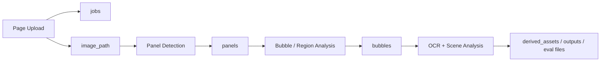
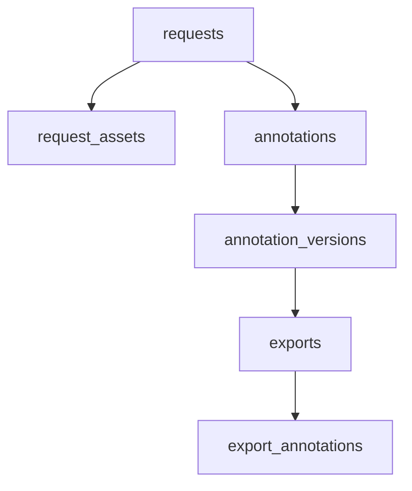

# Database Architecture

This project now uses a hybrid persistence model in two layers:

- `SQLite` stores metadata, state, relationships, and training/eval lineage.
- `Filesystem` stores heavy artifacts such as source images, derived images, COCO exports, logs, and model checkpoints.

Current implementations:
- legacy/current DB: [modules/database.py](/Users/sajith/Documents/New%20project/manga-to-movie/modules/database.py)
- next-step DB layer: [modules/database_v2.py](/Users/sajith/Documents/New%20project/manga-to-movie/modules/database_v2.py)

## Current Live State

Today the app is in a transitional hybrid state:

- the legacy SQLite database is still active for:
  - image metadata
  - jobs and job events
  - panels and bubbles
  - training/eval metadata
- the new v2 SQLite database is now active for:
  - `requests`
  - `request_assets`
  - override-derived `annotations`
  - `annotation_versions`
- the override workspace still writes a JSON mirror to:
  - `outputs/<request_id>/panel_overrides.json`
- override loading is now:
  - `v2 SQLite first`
  - `JSON fallback`

## Runtime Model



## SQLite Settings

The connection helper already enables the right SQLite runtime settings for this app:

- `PRAGMA foreign_keys = ON`
- `PRAGMA journal_mode = WAL`
- `PRAGMA synchronous = NORMAL`

This is important because the API will do frequent small writes while export/eval flows may do longer reads.

## Current Tables

### `image_path`
Canonical registry for image files.

Purpose:
- deduplicate images by `sha256`
- track canonical file path and image metadata
- anchor related panel/bubble/training records

Key columns:
- `asset_key`
- `sha256`
- `canonical_path`
- `file_name`
- `width`, `height`, `byte_size`
- `source_type`

### `datasets_split`
Tracks dataset membership and review state for an image.

Purpose:
- know which dataset and split an image belongs to
- track annotation/review status over time

Key columns:
- `image_id`
- `dataset_name`
- `split_name`
- `split_version`
- `annotation_status`
- `review_status`
- `is_current`

### `panels`
Stores detected or manually supplied panel geometry for an image.

Purpose:
- persist panel boxes/polygons
- support detector output and manual correction

Key columns:
- `image_id`
- `panel_index`
- `x`, `y`, `width`, `height`
- `polygon_json`
- `source`
- `confidence`
- `is_active`

### `bubbles`
Stores bubble or text-region geometry for an image.

Purpose:
- persist speech/narration/SFX-like regions
- keep optional OCR text at the region level

Key columns:
- `image_id`
- `panel_id`
- `bubble_type`
- `x`, `y`, `width`, `height`
- `polygon_json`
- `ocr_text`
- `source`
- `confidence`
- `is_active`

### `derived_assets`
Tracks generated files related to an image or panel.

Purpose:
- index previews, crops, renders, or other derived outputs
- mark stale generated assets when upstream geometry changes

Key columns:
- `image_id`
- `panel_id`
- `asset_type`
- `derived_path`
- `sha256`
- `generator`
- `is_stale`

### `jobs`
Per-request job state table.

Purpose:
- track request lifecycle from API/worker perspective
- map `request_id` to input/output paths and job metadata

Key columns:
- `request_id`
- `job_type`
- `image_id`
- `status`
- `filename`
- `input_path`
- `output_path`
- `payload_json`

### `job_events`
Event log for request/job transitions.

Purpose:
- keep audit trail for state changes
- debug pipeline behavior over time

Key columns:
- `request_id`
- `event_type`
- `status`
- `details_json`

### `annotation_events`
Audit table for annotation workflow changes.

Purpose:
- record save/review/export actions
- keep timeline for dataset activity

Key columns:
- `image_id`
- `dataset_name`
- `split_name`
- `event_type`
- `actor`
- `details_json`

### `training_results`
Registry for training runs.

Purpose:
- store model-training configuration and outputs
- track best/final checkpoints and summary metrics

Key columns:
- `run_key`
- `model_type`
- `dataset_name`
- `epochs`
- `batch_size`
- `learning_rate`
- `best_checkpoint_path`
- `final_checkpoint_path`
- `best_train_loss`
- `status`
- `metrics_json`

### `validation_results`
Per-eval or per-validation result rows linked to training.

Purpose:
- keep valid/test metrics with dataset context
- support comparisons over time

Key columns:
- `training_result_id`
- `dataset_name`
- `split_name`
- `loss`
- `map_50`
- `map_50_95`
- `precision_score`
- `recall_score`
- `metrics_json`

## How It Maps To The Current Pipeline

Current runtime flow:



Notes:
- Training still consumes exported COCO datasets from the filesystem, not raw override JSON.
- The JSON override file is still kept as a mirror/debug artifact.
- The v2 database is now the primary source for panel boxes and region annotations when loading overrides.

## Current Live Architecture

```mermaid
flowchart TD
    subgraph API["FastAPI"]
        A1["/generate-video"]
        A2["/detect-panels"]
        A3["/generate-script"]
        A4["/analyze-panels"]
        A5["/panel-overrides POST"]
        A6["/panel-overrides/{request_id} GET"]
    end

    subgraph DB1["Legacy SQLite"]
        D1["image_path"]
        D2["datasets_split"]
        D3["panels"]
        D4["bubbles"]
        D5["derived_assets"]
        D6["jobs"]
        D7["job_events"]
        D8["training_results"]
        D9["validation_results"]
    end

    subgraph DB2["SQLite v2"]
        V1["requests"]
        V2["request_assets"]
        V3["annotations"]
        V4["annotation_versions"]
        V5["exports"]
        V6["export_annotations"]
    end

    subgraph FS["Filesystem"]
        F1["uploads/ and temp/"]
        F2["outputs/<request_id>/"]
        F3["panel_overrides.json"]
        F4["exported_coco/"]
        F5["models/"]
    end

    A1 --> D1
    A1 --> D6
    A1 --> V1
    A1 --> V2
    A1 --> F1

    A2 --> D1
    A2 --> D3
    A2 --> V1
    A2 --> V2
    A2 --> F2

    A3 --> D1
    A3 --> D3
    A3 --> V1
    A3 --> V2
    A3 --> F2

    A4 --> D1
    A4 --> D3
    A4 --> V1
    A4 --> V2
    A4 --> F2

    A5 --> F3
    A5 --> D6
    A5 --> D7
    A5 --> V1
    A5 --> V3
    A5 --> V4

    A6 --> V1
    A6 --> V3
    A6 --> V4
    A6 --> F3
```



## Recommended Next-Step Tables

For the next DB-backed phase, the clean relational model would be:



Recommended additions:

### `requests`
Root row for each pipeline run or uploaded page.

Suggested fields:
- `request_id`
- `status`
- `fs_root_path`
- `created_at`
- `updated_at`

### `request_assets`
File pointer table for source images, crops, previews, and debug images.

Suggested fields:
- `asset_id`
- `request_id`
- `asset_type`
- `rel_path`
- `metadata_json`

### `annotations`
Logical annotation entity.

Suggested fields:
- `annotation_id`
- `request_id`
- `asset_id`
- `label_type`
- `current_version_id`

### `annotation_versions`
Version history for panel and region geometry.

Suggested fields:
- `version_id`
- `annotation_id`
- `data_json`
- `created_by`
- `is_manual_override`
- `created_at`

### `exports`
Tracks generated COCO/YOLO exports.

Suggested fields:
- `export_id`
- `format`
- `fs_export_path`
- `created_at`

### `export_annotations`
Join table for exact export lineage.

Suggested fields:
- `export_id`
- `version_id`

## Proposed SQLite DDL

These statements are for the recommended next-step schema only. They are not wired into the application yet.

```sql
PRAGMA foreign_keys = ON;
PRAGMA journal_mode = WAL;
PRAGMA synchronous = NORMAL;

CREATE TABLE IF NOT EXISTS requests (
    request_id TEXT PRIMARY KEY,
    status TEXT NOT NULL,
    fs_root_path TEXT NOT NULL,
    panel_mode TEXT,
    bubble_mode TEXT,
    metadata_json TEXT NOT NULL DEFAULT '{}',
    created_at TEXT NOT NULL DEFAULT CURRENT_TIMESTAMP,
    updated_at TEXT NOT NULL DEFAULT CURRENT_TIMESTAMP
);

CREATE TABLE IF NOT EXISTS request_assets (
    asset_id INTEGER PRIMARY KEY AUTOINCREMENT,
    request_id TEXT NOT NULL,
    asset_type TEXT NOT NULL,
    rel_path TEXT NOT NULL,
    panel_index INTEGER,
    metadata_json TEXT NOT NULL DEFAULT '{}',
    created_at TEXT NOT NULL DEFAULT CURRENT_TIMESTAMP,
    updated_at TEXT NOT NULL DEFAULT CURRENT_TIMESTAMP,
    FOREIGN KEY(request_id) REFERENCES requests(request_id) ON DELETE CASCADE
);

CREATE INDEX IF NOT EXISTS idx_request_assets_request
ON request_assets(request_id, asset_type);

CREATE TABLE IF NOT EXISTS annotations (
    annotation_id INTEGER PRIMARY KEY AUTOINCREMENT,
    request_id TEXT NOT NULL,
    asset_id INTEGER,
    entity_type TEXT NOT NULL,
    label_type TEXT NOT NULL,
    role TEXT,
    current_version_id INTEGER,
    is_active INTEGER NOT NULL DEFAULT 1,
    created_at TEXT NOT NULL DEFAULT CURRENT_TIMESTAMP,
    updated_at TEXT NOT NULL DEFAULT CURRENT_TIMESTAMP,
    FOREIGN KEY(request_id) REFERENCES requests(request_id) ON DELETE CASCADE,
    FOREIGN KEY(asset_id) REFERENCES request_assets(asset_id) ON DELETE SET NULL
);

CREATE INDEX IF NOT EXISTS idx_annotations_request
ON annotations(request_id, entity_type, label_type, is_active);

CREATE TABLE IF NOT EXISTS annotation_versions (
    version_id INTEGER PRIMARY KEY AUTOINCREMENT,
    annotation_id INTEGER NOT NULL,
    data_json TEXT NOT NULL,
    created_by TEXT,
    source_type TEXT NOT NULL DEFAULT 'manual_override',
    is_manual_override INTEGER NOT NULL DEFAULT 0,
    is_active INTEGER NOT NULL DEFAULT 1,
    notes TEXT,
    created_at TEXT NOT NULL DEFAULT CURRENT_TIMESTAMP,
    FOREIGN KEY(annotation_id) REFERENCES annotations(annotation_id) ON DELETE CASCADE
);

CREATE INDEX IF NOT EXISTS idx_annotation_versions_annotation
ON annotation_versions(annotation_id, created_at);

CREATE TABLE IF NOT EXISTS exports (
    export_id TEXT PRIMARY KEY,
    format TEXT NOT NULL,
    dataset_name TEXT,
    fs_export_path TEXT NOT NULL,
    status TEXT NOT NULL DEFAULT 'created',
    metadata_json TEXT NOT NULL DEFAULT '{}',
    created_at TEXT NOT NULL DEFAULT CURRENT_TIMESTAMP
);

CREATE TABLE IF NOT EXISTS export_annotations (
    export_id TEXT NOT NULL,
    version_id INTEGER NOT NULL,
    PRIMARY KEY(export_id, version_id),
    FOREIGN KEY(export_id) REFERENCES exports(export_id) ON DELETE CASCADE,
    FOREIGN KEY(version_id) REFERENCES annotation_versions(version_id) ON DELETE CASCADE
);

CREATE INDEX IF NOT EXISTS idx_export_annotations_version
ON export_annotations(version_id);
```

### Notes On The Proposed DDL

- `requests` is the root row for one uploaded page or pipeline request.
- `request_assets` stores pointers to source files, preview images, temp crops, or debug renders on disk.
- `annotations` is the logical object being labeled.
- `annotation_versions` stores the actual geometry and version history in `data_json`.
- `exports` stores dataset export metadata.
- `export_annotations` makes export lineage queryable without packing IDs into one JSON/text field.

## Migration Direction

Recommended transition order:

1. Keep filesystem artifacts as they are.
2. Keep writing request metadata into `requests` and `request_assets`.
3. Keep writing override geometry into `annotations` and `annotation_versions`.
4. Move override summary fields fully into `requests.metadata_json`.
5. Move export lineage into `exports` and `export_annotations`.
6. Let training/eval query SQLite for metadata and filesystem paths.

## Practical Rule

Use:
- `SQLite` for truth about state and relationships
- `filesystem` for truth about large binaries

That keeps the system queryable without forcing large media artifacts into the database.
